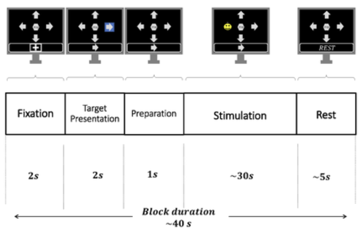

# EEG Brain Activity Analysis with Machine Learning

## 🧠 Project Overview

This project explores how to analyze brain activity using **electroencephalography (EEG)** signals and classify cognitive states through **machine learning models**. 

EEG data was collected using the **Unicorn Hybrid Black** device, and multiple experiments were conducted to classify different types of brain responses, such as:

- Detection of **P300 event-related potentials**
- Identification of **cognitive tasks** (e.g., reading, math, object naming)
- Comparison between **task engagement vs resting state**
- Preliminary tests on **transfer learning** between individuals

---

## Table of Contents

- [Project Description](#project-description)
- [EEG Signal Acquisition](#eeg-signal-acquisition)
- [Experiments](#experiments)
  - [1. P300 Classification](#1-p300-classification)
  - [2. Cognitive Task Classification](#2-cognitive-task-classification)
  - [3. Resting vs Task State](#3-resting-vs-task-state)
- [Machine Learning Models](#machine-learning-models)
- [Results Summary](#results-summary)
- [Feature Selection](#feature-selection)
- [Transfer Learning](#transfer-learning)
- [Technologies Used](#technologies-used)
- [Author](#author)

---

## Project Description

The goal of this project is to classify brain states using machine learning on EEG data. Signals were acquired while participants performed various tasks, and models were trained to detect specific patterns related to attention, cognition, and mental effort.

This study has potential applications in areas like:

- Brain-Computer Interfaces (BCIs)
- Assistive technology for people with motor disabilities
- Cognitive workload assessment
- Mental health monitoring

---

## ⚙️ EEG Signal Acquisition

- **Device Used**: Unicorn Hybrid Black
- **Channels**: Fz, C3, Cz, C4, Pz, PO7, Oz, PO8
- **Sampling Rate**: 250 Hz
- **Reference Electrodes**: Positioned under the earlobes
- **Signal Range**: Approximately -100 µV to 100 µV

Preprocessing involved bandpass filtering, downsampling, and feature extraction based on time and frequency domain analyses.

---

## 🧪 Experiments

### 1. P300 Classification

- **Goal**: Detect the P300 wave, a brain response to rare or significant stimuli.
- **Method**:
  - Recorded 800 ms post-stimulus windows.
  - Applied a bandpass filter (4–20 Hz).
  - Reduced 8 EEG channels to 4 using spatial filtering.
  - Final features: 50 samples per selected channel.
- **Application**: BCIs for communication through attention (e.g., selecting characters on a screen).

  

---

### 2. Cognitive Task Classification

- **Goal**: Classify the type of mental task being performed:
  - Math problems (9–12)
  - Reading tasks (5–8)
  - Object naming (1–4)
- **Phases**:
  - "Cross" (rest): 10 sec
  - "Task": 15 sec
  - "Rest": 5 sec
- **Features**:
  - Power Spectral Density (PSD) of each analysis window.
  - Highest-energy frequencies used for classification.

---

### 3. Resting vs Task State

- **Goal**: Distinguish between a resting state and active cognitive engagement.
- **Observation**: Class imbalance affected performance.
- **Models**: Logistic Regression, MLP, and KNN performed best overall.

---

## Machine Learning Models

The following models were trained and evaluated:

- **K-Nearest Neighbors (KNN)**
- **Support Vector Machines (SVM)**
- **Multilayer Perceptron (MLP)**
- **Logistic Regression**
- **Random Forest**

Each model's hyperparameters (e.g., activation functions, hidden layers) were optimized for each task.

---

##  Results Summary

### P300 vs Non-P300

| Model               | Accuracy (Avg) | Balanced Recall         |
|--------------------|----------------|--------------------------|
| Logistic Regression| ~78%           | Most balanced across classes |
| Random Forest      | Up to ~80%     | Recall biased to one class  |

### Cognitive Tasks (Math vs Reading vs Naming)

| Model               | Accuracy (Max) | Comment                   |
|--------------------|----------------|----------------------------|
| All models          | ~63% max       | Dataset too small for strong generalization |

### Task vs Rest State

| Model               | Accuracy (Max) | Balanced Recall         |
|--------------------|----------------|--------------------------|
| Logistic Regression| ~71%           | Good recall on both classes |
| Random Forest      | ~81% (some cases) | Recall varied heavily      |

---

##  Feature Selection

Reducing features helped:
- Decrease training time
- Improve generalization in some cases
- Preserve accuracy when carefully selecting features (e.g., PSD peaks)

---

## Transfer Learning

Attempted transferring models across participants. Performance was limited due to:
- High inter-subject variability in EEG signals
- Need for normalization or domain adaptation techniques

---

## 🛠️ Technologies Used

- **Python**
- **Scikit-learn**
- **NumPy**, **Pandas**, **Matplotlib**
- **Unicorn Hybrid Black** (EEG device)

